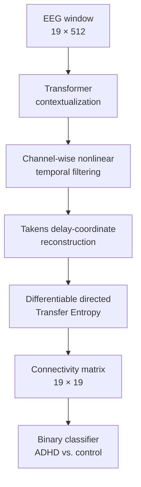

# CTE-Net

## Contextualized Transfer Entropy Network for EEG-Based ADHD Classification

[](https://www.python.org/)
[](https://jupyter.org/)
[](https://pytorch.org/)
[](#license)

CTE-Net is an end-to-end deep-learning architecture for classifying
attention-deficit/hyperactivity disorder (ADHD) from pediatric
electroencephalography (EEG). It combines Transformer-based contextualization
with nonlinear temporal filtering, Takens delay-coordinate reconstruction, and
differentiable matrix-based Transfer Entropy (TE).

Unlike pipelines in which connectivity is computed as a fixed preprocessing
step, CTE-Net learns task-oriented representations and directed predictive
information dependencies jointly with the classifier. The resulting TE matrix
provides an explicit representation of nonlinear, time-delayed, and directional
interactions between EEG channels.

> **Research status:** this repository accompanies the manuscript
> *Transformer-Based Modeling of Directed Transfer Entropy Connectivity for
> EEG-Based ADHD Classification in Children*. The code and documentation may
> change while the manuscript is under review.

## Highlights

- End-to-end learning from multichannel EEG windows.
- Global content-based contextualization with a Transformer encoder.
- Channel-wise nonlinear temporal filtering.
- Takens delay-coordinate embeddings for source and target dynamics.
- Differentiable Transfer Entropy based on Rényi's matrix entropy and a
  rational quadratic kernel.
- Explicit directed connectivity features for model inspection.
- Subject-wise evaluation designed to prevent participant leakage.
- Analysis of within-subject variability across the network stages.
- Comparisons with EEGNet, ShallowConvNet, T-GARNet, IMC-BGT, and MultiStream.

## Model overview



For an EEG window \(\mathbf{X}\in\mathbb{R}^{C\times T}\), CTE-Net first
contextualizes the complete multichannel sequence. The filtered signals are
then reconstructed into source-past, target-past, and target-present states.
For every ordered electrode pair, the TE layer estimates the predictive
information transferred from the source to the target beyond the information
already contained in the target's own history.

The estimated values should be interpreted as **directed predictive
dependencies**, not as definitive evidence of causal influence.

## Dataset and preprocessing

The experiments use the public
[EEG Data for ADHD/Control Children](https://ieee-dataport.org/open-access/eeg-data-adhd-control-children)
dataset.

| Property | Experimental setting |
| --- | --- |
| Analyzed cohort | 120 participants: 60 ADHD and 60 controls |
| Age range | 7–12 years |
| EEG montage | 19 channels, international 10–20 system |
| Sampling rate | 128 Hz |
| Task | Visual continuous-performance task |
| Window length | 4 s (512 samples) |
| Window overlap | 50% |
| Additional preprocessing | No artifact rejection, ICA, frequency filtering, or band decomposition |
| Evaluation split | Five fixed stratified subject-wise folds |
| Repetitions | Ten random seeds; 50 trained models in total |

The dataset is not redistributed in this repository. Download it from the
original source and place it under `data/raw/` as described in
[Prepare the data](#4-prepare-the-data). Keep every participant exclusively in
one training, validation, or test subset to avoid subject-level information
leakage.

## Architecture configuration

| Stage | Main configuration |
| --- | --- |
| Input | \(C=19\), \(T=512\) |
| Transformer | 2 layers, 2 attention heads, embedding size 32, feed-forward size 256, dropout 0.4 |
| Temporal filter | Depthwise Conv1D, kernel size 99, stride 1, average pooling 4 |
| Takens embedding | \(D_x=4\), \(D_y=2\), delay \(\tau=5\), prediction horizon \(\mu=5\) |
| Kernel TE | Rational quadratic kernel, \(\alpha_{\mathrm{RQ}}=1\), Rényi order \(\alpha_R=2\) |
| Classifier | Dense layer with 128 units, dropout 0.1, one sigmoid output |

## Repository structure

```text
CTE-Net/
├── Models/                  # CTE-Net and every baseline, one notebook each
│   ├── tdha-CTE-Net.ipynb       # proposed model (filename is a historical artifact)
│   ├── EEGNet-Pytorch.ipynb
│   ├── Shallow-Pytorch.ipynb
│   ├── T-Garnet.ipynb
│   ├── IM-CBGT.ipynb
│   └── MultiStream.ipynb
├── Ablation/                # CTE-Net with the Transformer and/or TE branch removed
│   ├── cte-net-sin-trans-5-folds.ipynb
│   ├── cte-net-5-folds-con-trans-sin-te.ipynb
│   └── cte-net-5-folds-sin-te-con-global.ipynb
├── analysis/                 # connectivity interpretability and per-subject/statistical-test notebooks
│   ├── Interpretability/
│   └── Subjects/             # includes the Friedman cross-method comparison notebook
├── tests/
│   └── test_notebooks_smoke.py   # verifies every notebook still runs end-to-end
├── requirements.txt
└── data/                      # gitignored, populated locally — see "Prepare the data"
    └── raw/
```

`Models/` and `Ablation/` are the notebooks referenced throughout this README.
`analysis/` holds supplementary work built on top of CTE-Net's outputs
(connectivity interpretability, per-subject and statistical-test notebooks);
see [Repository provenance](#repository-provenance) for its origin.

## Getting started

### 1. Clone the repository

```bash
git clone https://github.com/alegomezri/CTE-Net.git
cd CTE-Net
```

### 2. Create an isolated environment

```bash
python -m venv .venv
```

Activate it on Linux or macOS:

```bash
source .venv/bin/activate
```

Activate it on Windows PowerShell:

```powershell
.\.venv\Scripts\Activate.ps1
```

### 3. Install the dependencies

```bash
pip install -r requirements.txt
```

### 4. Prepare the data

1. Download the [EEG Data for ADHD/Control Children](https://ieee-dataport.org/open-access/eeg-data-adhd-control-children)
   dataset from IEEE DataPort (`.mat` files, one per subject, split into
   `ADHD_group` and `Control_group`).
2. Place them under `data/raw/ieee/ADHD_group/` and `data/raw/ieee/Control_group/`
   — `data/` is gitignored, so this never touches version control:

   ```text
   CTE-Net/
   └── data/
       └── raw/
           ├── ieee/
           │   ├── ADHD_group/     # *.mat, one per ADHD subject
           │   └── Control_group/  # *.mat, one per control subject
           └── folds.pkl           # the fixed 5-fold subject-wise split (see below)
   ```
3. `folds.pkl` fixes which subjects fall in which of the five cross-validation
   folds so every model in this repo is compared on identical splits. Every
   notebook in `Models/` and `Ablation/` loads it from `data/raw/folds.pkl`.
   If you don't have it, generate one with `StratifiedGroupKFold(n_splits=5,
   shuffle=True, random_state=42)` over the subject list — this reproduces the
   methodology but not necessarily the exact published fold membership.

Each notebook's data path is a relative `os.path.join("..", "data", "raw", ...)`
(or `Path("..") / "data" / "raw"` in `Ablation/`) — no per-notebook editing
needed if you follow the layout above.

### 5. Run an experiment

```bash
jupyter lab
```

Open the desired notebook under `Models/` or `Ablation/` and execute its cells
in order. For a fair comparison, reuse the same subject-wise partitions
(`folds.pkl`), preprocessing, validation protocol, and random seeds for every
model — this is already how the notebooks are wired.

### 6. Verify everything runs

```bash
pytest tests/
```

Runs every notebook end-to-end with `CTE_NET_SMOKE_TEST=1` (shrinks
epochs/seeds/Optuna trials so it finishes in minutes) against your local
`data/raw/`. This checks the pipeline executes correctly — it is not a
substitute for the full protocol described above.

## Evaluation protocol

- Five-fold stratified group cross-validation.
- Twenty-four participants held out for testing in each fold.
- Subject-independent training, validation, and test subsets.
- Binary cross-entropy optimization with early stopping.
- Validation-based checkpoint selection.
- Hyperparameter optimization with 20 Optuna trials and pruning.
- ADHD treated as the positive class.
- Window-level decision threshold of 0.5.
- Metrics averaged across the five folds for each seed and summarized across
  ten seeds.
- Paired two-sided Wilcoxon signed-rank tests with Holm correction for model
  comparisons.

## Main results

### Window-level classification

| Model | Accuracy (%) | Precision (%) | Recall (%) |
| --- | ---: | ---: | ---: |
| EEGNet | 81.5 ± 2.1 | 84.3 ± 2.2 | 83.5 ± 3.6 |
| ShallowConvNet | **84.1 ± 1.7** | **88.0 ± 2.9** | 81.7 ± 2.4 |
| T-GARNet | 77.4 ± 0.5 | 76.9 ± 0.8 | 85.5 ± 1.1 |
| IMC-BGT | 66.1 ± 1.2 | 68.2 ± 1.4 | 74.4 ± 3.4 |
| MultiStream | 58.6 ± 0.6 | 58.7 ± 0.3 | **86.5 ± 2.2** |
| **CTE-Net** | **80.7 ± 1.7** | **82.2 ± 2.1** | **84.0 ± 2.3** |

CTE-Net was statistically comparable to EEGNet across accuracy, precision, and
recall. ShallowConvNet achieved higher accuracy and precision, whereas CTE-Net
outperformed T-GARNet, IMC-BGT, and MultiStream in accuracy and precision under
the reported corrected comparisons. The principal contribution of CTE-Net is
therefore not a claim of uniform predictive superiority, but the combination of
competitive classification with an explicit nonlinear and directed
connectivity representation.

### Representation-space organization

| Representation | Window silhouette ↑ | Participant-centroid silhouette ↑ | Same/different-class distance ratio ↓ |
| --- | ---: | ---: | ---: |
| Raw EEG | 0.0558 | 0.0210 | 0.9887 |
| Transformer output | 0.0712 | 0.2640 | 0.7056 |
| Temporal filter | 0.1326 | 0.3316 | 0.6326 |
| **Transfer Entropy** | **0.2148** | **0.3557** | **0.6031** |

The directed TE representation yielded the lowest within-subject dispersion,
with a median reduction of **38.35%** relative to raw EEG. The result remained
consistent across alternative PCA dimensionalities and distance definitions.

## Reproducibility notes

- Do not randomly split individual EEG windows across subsets.
- Record the random seed, fold, checkpoint, and preprocessing configuration for
  each run.
- Fit transformations used for evaluation, including standardization and PCA,
  without access to held-out participant information.
- Keep dataset files, checkpoints, and generated results out of Git unless their
  redistribution is permitted.
- Report whether results correspond to window-level or participant-level
  decisions.

## Citation

If this code contributes to your research, please cite the accompanying
manuscript. The bibliographic information below should be updated when the
article receives its final journal, volume, pages, and DOI.

```bibtex
@article{gomezrivera2026ctenet,
  title   = {Transformer-Based Modeling of Directed Transfer Entropy
             Connectivity for EEG-Based ADHD Classification in Children},
  author  = {Gomez-Rivera, A. and Pastrana-Cortes, J. D. and
             Alvarez-Meza, Andres M. and Gil-Gonzalez, J. and
             Cardenas-Pena, D.},
  year    = {2026},
  note    = {Manuscript under review}
}
```

## Repository provenance

The notebooks under `analysis/` (connectivity interpretability, per-subject
evaluation, and the Friedman statistical-test notebook) originate from
[alegomezri/CTE-Net](https://github.com/alegomezri/CTE-Net), a companion
repository that extends the analyses in `Models/`.

## Authors

- **A. Gomez-Rivera** — Signal Processing and Recognition Group, Universidad Nacional de Colombia
- **J. D. Pastrana-Cortés** — Automatics Research Group, Universidad Tecnológica de Pereira
- **Andrés M. Álvarez-Meza** — Signal Processing and Recognition Group, Universidad Nacional de Colombia
- **J. Gil-Gonzalez** — Automatics Research Group, Universidad Tecnológica de Pereira
- **D. Cárdenas-Peña** — Automatics Research Group, Universidad Tecnológica de Pereira

## Funding

This work was supported by the research program *Alianza Científica con Enfoque
Comunitario para Mitigar Brechas de Atención y Manejo de Trastornos Mentales
Relacionados con Impulsividad en Colombia - ACEMATE*, grant 111091991908.

## Responsible use

CTE-Net is intended for research purposes. It is not a medical device and must
not be used as a stand-alone diagnostic system. ADHD assessment requires
qualified clinical evaluation and information from multiple sources.

## License

No software license has yet been specified. Add a `LICENSE` file before
redistributing or accepting external contributions. The license of the
accompanying article does not automatically define the license of this source
code.

## Contact

For questions about the repository or the manuscript, please contact
[A. Gomez-Rivera](mailto:yeagomezri@unal.edu.co).
